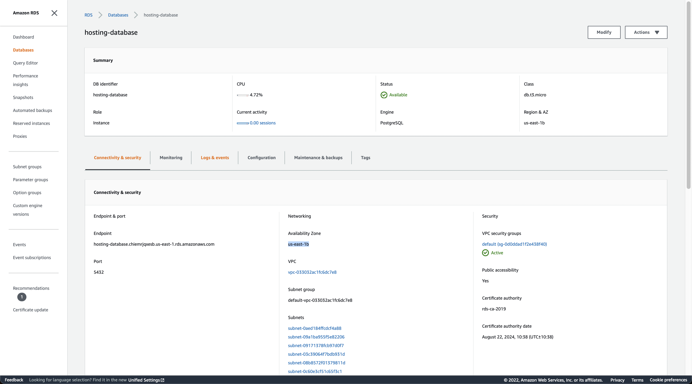

### Infrastructure Architecture

* This website is being hosted on AWS.
* Elastic Beanstalk is used for the Backend API(Node JS).
* S3 bucket for the frontend and uploaded images.
* RDS database running Postgres.

### Screenshots:

* Infrastructure of the site

* AWS Elastic Beanstalk Service

* AWS RDS database

* AWS S3 frontend bucket

